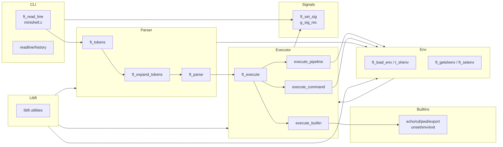

# Minishell – Arquitectura

## 1. Análisis arquitectónico

- `minishell.c` implementa el ciclo principal `ft_read_line`: configura señales (`ft_set_sig`), carga el entorno con `ft_load_env`, obtiene líneas con `readline`, almacena histórico y, tras cada iteración, reutiliza la lista `t_cli`.
- La fase de **lexing/expansión** (`parsing/lexing.c`, `parsing/expansion.c`) tokeniza la línea, expande variables/estado de salida y resuelve wildcards (`parsing/wildcards.c`), manteniendo compatibilidad con heredocs y comillas.
- El **parser** (`parsing/parsing.c`, `parsing/parsing1.c`) transforma los tokens en una lista enlazada de `t_cli`, configurando redirecciones, heredocs y operadores lógicos/pipes.
- El **ejecutor** (`exec/ft_execute.c`) orquesta la ejecución decidiendo entre builtins (`exec/aux_exec/exec_builtin.c`), pipelines (`execute_pipeline`) y procesos externos (`execute_command`) usando `fork/execve`.
- Las redirecciones se aplican en `exec/aux_exec/apply_redirs.c` antes de la ejecución del comando.
- La **gestión del entorno** (`parsing/shenv.c`, `exec/builtins/ft_*.c`) mantiene un `t_shenv` enlazado y sincroniza variables especiales (`PWD`, `OLDPWD`, etc.).
- Utilidades y memoria recaen en `libft/` (funciones `ft_*` de cadenas, listas y arrays), que actúa como capa de servicios compartidos.

## 2. Tecnologías utilizadas

- Lenguaje C con estándar POSIX (`fork`, `execve`, `pipe`, `dup2`, `waitpid`, `ioctl`, señales).
- GNU Readline (`-lreadline`) para prompt interactivo y gestión del histórico.
- Biblioteca propia `libft` como soporte de utilidades generales.
- `Makefile` que enlaza `libft` y `readline` y compila los módulos del proyecto.

## 3. Estructura de carpetas y archivos

```text
.
├── minishell.c            # Bucle principal, configuración de señales y entrada
├── minishell.h            # Definiciones de structs, macros y prototipos
├── exec/                  # Motor de ejecución
│   ├── ft_execute.c       # Orquestador (ft_execute, execute_pipeline, execute_command)
│   ├── mac_stub.c         # Stub para compatibilidad (si aplica)
│   ├── exec.h             # Cabeceras de ejecución
│   ├── builtins/          # Comandos internos (builtins)
│   │   ├── ft_cd.c
│   │   ├── ft_echo.c
│   │   ├── ft_env.c
│   │   ├── ft_exit.c
│   │   ├── ft_export.c
│   │   ├── ft_pwd.c
│   │   ├── ft_unset.c
│   │   └── ...
│   └── aux_exec/          # Funciones auxiliares de ejecución
│       ├── apply_redirs.c # Aplicación de redirecciones (<, >, >>)
│       ├── exec_builtin.c # Wrapper para llamar builtins
│       └── has_pipe.c     # Detección de pipes
├── parsing/               # Lexing, parsing, expansiones, env interno, señales
│   ├── lexing.c           # Tokenización
│   ├── parsing.c          # Construcción del AST / lista de comandos
│   ├── expansion.c        # Expansión de variables $VAR
│   ├── heredoc.c          # Gestión de HereDocs
│   ├── wildcards.c        # Expansión de wildcards (*)
│   ├── shenv.c            # Gestión de variables de entorno
│   └── signals.c          # Manejo de señales (Ctrl+C, Ctrl+\)
├── libft/                 # Biblioteca auxiliar con funciones reutilizables
│   ├── libft.h
│   ├── Makefile
│   └── ft_*.c
├── Makefile               # Objetivo `minishell`, vínculo con `libft` y readline
├── test_fds.sh            # Script para pruebas de file descriptors
├── readline.supp          # Supresiones de valgrind para readline
└── README.md              # Informe arquitectónico del proyecto
```

## 4. Diagrama de arquitectura

