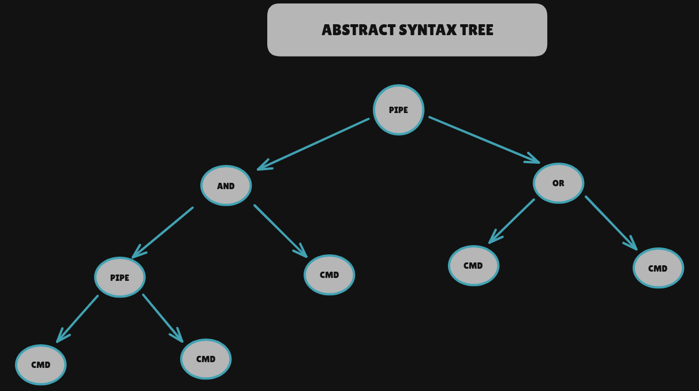

# Architecture Documentation

## Data Flow

## Structs

# Minishell Structures

For this project, we have decided not to use malloc, avoiding memory allocation on the heap, and moving the necessary buffers to the stack and, primarily, to .bss and .data. The reason is mostly personal: to learn practices more often required in embedded system software development. By avoiding the heap, we prevent one of the most common bugs in C programming: not freeing allocated memory.

Furthermore, it forces us to anticipate memory usage from the beginning of the program and to set limits on data structures that might otherwise grow dynamically without bounds. This allows us to know the system's worst-case memory performance from the start. The other advantage is execution speed, as we do not have to search the heap.

There are many disadvantages: more complexity in development of the project, the need for artificial bounds to the memory, an unnecessary heavier program on average… Still, it’s a choice of personal development and not of practicality.

## Memory Arenas

We use three static memory arenas, one for the input line, another one for the Abstract Syntax Tree content and the third one for local and environment variables and command. They all have a semi-arbitrary size, given that there are no bottlenecks in other places of the program that limit the functionality of the shell. For example, there's no limit of commands in one prompt for the bonus part, or there’s no limit for the number of redirections of a command, so in principle you can redirect until you fill the RAM with the line buffer; there's also no limit to the size of a variable (or number of variables), local or environmental.

There are, nonetheless, some bottlenecks that, when considered, can give us an approximation of a size that makes sense. For example, execve just accepts a total of ~2MB of  arguments (args + envp), there’s a limit to the opened file descriptors at the same time (for the mandatory part, that implies a limit of commands).

### Local and Environment Variable Lists

We use an arena of chars, with the first byte previous to every variable used to differenciate local (1) from environment (2) variables. There's no limit to the number of variables (local or environmental), or the size of each value. But execve only accepts ARG_MAX ~ 2MB of arguments (args + envp), and we are going to use this size limit for the pool that stores the variables refernced by the linked list.

### Tokens and Expanded Tokens

For tokenization we create an Abstract Syntax Tree in the next form:

This is stored on the second buffer. We expand variables inside the tree. If we run out of memory, then we can rewrite the buffer to fill the gaps and get some more memory at the end of the buffer. 

### Command Environment

A struct containing all the information each command needs for execution:
* The command to execute (with or without a path, string).
* The command arguments, the names of the files for input and output redirection (if any, strings) then reconverted to fd's (int), and their mode (in case it's appended instead of truncated).
* Heredoc if present (we have decided to simplify and pass a string directly instead of writing to temporary files).
* Pointers to the previously mentioned variable lists.
* Possible redirections and their type.

### Global Variable

A single global variable is used to capture signal delivery and handle them differently within a heredoc, open quotes or operators, and in parent and child processes. The type is volatile sigatomic_t.

## Signal Handling

